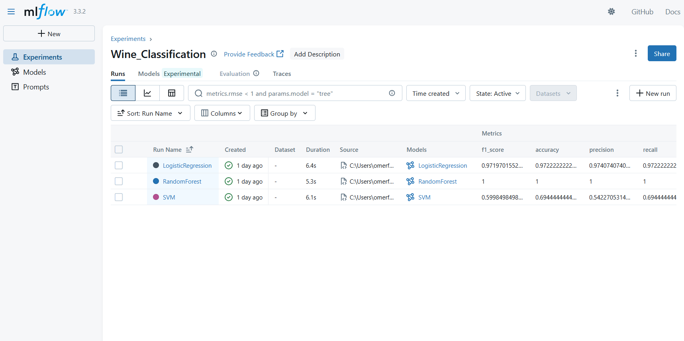
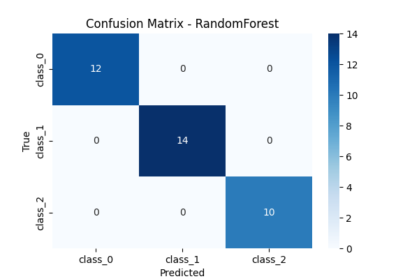
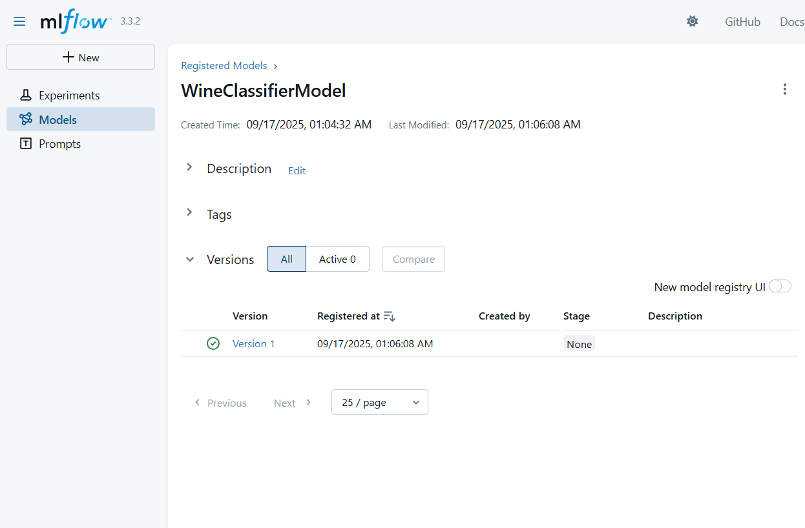

# MLOps Assignment 1 — Wine Classification

## Objective
The purpose of this assignment is to:
1. Use GitHub for version control and collaboration.
2. Train and compare multiple machine learning models.
3. Track experiments using MLflow (parameters, metrics, artifacts).
4. Register the best model in the MLflow Model Registry.
5. Document the workflow in a reproducible manner.

---

## Problem Statement
We aim to classify wines into 3 categories (Class 0, Class 1, Class 2) using the **Wine dataset** from `scikit-learn`.  
The dataset contains **13 numerical features** such as alcohol, malic acid, ash, flavanoids, etc.  

**Dataset summary:**
- Number of samples: 178
- Number of features: 13
- Number of classes: 3
- Split: 80% training, 20% testing

---

## Project Structure

```
mlops-assignment-1/
├── data/ # dataset (if stored locally)
├── notebooks/ # Jupyter notebooks 
├── src/
│ ├── train_models.py #trains models and logs with MLflow
│ ├── mlflow_model_register.py #registers best model in MLflow
├── models/ # trained models (.joblib)
├── results/ # results CSVs, confusion matrices
├── docs/ # screenshots (MLflow UI, registry)
├── requirements.txt # dependencies
└── README.md # documentation
```

---

## Setup Instructions
1. Clone the repository:
```bash
git clone https://github.com/omerrfarooqq/mlops-assignment-1.git
cd mlops-assignment-1
```
2. Install requirements::
```
pip install -r requirements.txt
```
## How to Run

### Train models
```
python src/train_models.py
```

This will:

Train Logistic Regression, Random Forest, and SVM
Save trained models to /models/
Save metrics and confusion matrices to /results/
Log everything to MLflow under experiment Wine_Classification

## Start MLflow UI
```
mlflow ui
```
## MLflow Tracking

logged the following:

Parameters (e.g., hyperparameters for each model)

Metrics (Accuracy, Precision, Recall, F1)

Artifacts (confusion matrix plots, comparison CSV, trained models)

## Model Comparison Results

| Model              | Accuracy   | Precision  | Recall     | F1-Score   |
|--------------------|------------|------------|------------|------------|
| LogisticRegression | 0.9722     | 0.9741     | 0.9722     | 0.9720     |
| RandomForest       | 1.0000     | 1.0000     | 1.0000     | 1.0000     |
| SVM                | 0.6944     | 0.5423     | 0.6944     | 0.5998     |






## Model Registration

The best-performing model was RandomForest.

It was registered in the MLflow Model Registry as:

Model Name: WineClassifierModel

Version: 1



## Author
```
Muhammad Omer Farooq Khan
```